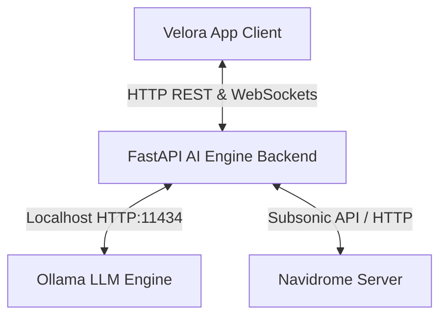

# Velora AI Engine: The "Minimalist Powerhouse" Blueprint

We've pivoted the architecture to focus on the absolute easiest, most frictionless developer experience without sacrificing the AI's core capabilities. Instead of a massive distributed enterprise stack, this blueprint utilizes ultra-lean 2026 local-first technologies.

## Target Deployment Environment
* **Platform:** Remote/Dedicated Ubuntu Server.
* **Target GPU:** NVIDIA GeForce RTX 3060 (12GB VRAM).
* **Local Machine Exception:** The development Windows machine contains an NVIDIA GeForce RTX 3070 (8GB VRAM). All Docker services and ML environments must be deployed and run on the target **Ubuntu Server**, not locally on the WDDM Windows machine.

---

## 1. AI Logic & Boundaries (Locked Decisions)

1.  **The "Emotional Arc" (Audio Granularity):** The AI will analyze the *entire track second-by-second*. 
2.  **Hybrid Truth (AI vs. Manual Tags):** **60/40 Hybrid Weighting**. 
3.  **Strictly Read-Only (Master Control Scope):** The AI will **never** alter your actual Navidrome database or touch your raw MP3/FLAC files.
4.  **Telemetry Data Scale:** We will store raw events locally, prioritizing low footprint over massive scale.

---

## 2. System Architecture & Tech Stack (The "Ultra-Lean" Stack)

By leveraging embedded databases, we can drastically reduce the number of Docker containers and VRAM overhead, making the system incredibly easy to install and maintain.

### A. The Storage Layer: `sqlite-vec` (The "All-in-One" File)
*   **What it is:** Instead of running massive database servers, we use **SQLite** with the brand new **`sqlite-vec`** extension.
*   **Why it's cutting edge but easy:** It requires zero setup, no passwords, and no separate Docker containers. Your standard relational data (metadata, track names), your raw telemetry (play/pause history), *and* your high-dimensional audio embeddings all live inside a single, hyper-fast local `.db` file on your hard drive. 

### B. Core Infrastructure & Machine Learning Stack
*   **Containers Required:** Only **Two** (FastAPI Backend + Ollama).
*   **FastAPI (Python):** The orchestrator API that also runs the embedded `sqlite-vec` database directly in memory.
*   **Conversational DJ:** `gemma-4-12b-it-qat-q4_0` via Ollama.
*   **Audio Embedding:** `CLAP` (Contrastive Language-Audio Pretraining).
*   **Acoustic Analysis:** `Essentia` for full-track emotional arcs.

---

## 3. Component Blueprint

### 1. The Telemetry Ingestion API
The Velora Swift app hits FastAPI, which writes the JSON event (play/pause/skip) directly into an SQLite `telemetry` table. No complex OLAP databases required.

### 2. The Audio Ingestion Worker (Background Task)
*   Reads the Navidrome music folder (Read-Only). 
*   Extracts BPM/Key via Essentia.
*   Passes chunks through the CLAP model.
*   Saves the audio embeddings into the `sqlite-vec` BLOB tables, ready for instant semantic search.

### 3. The Conversational Router
When you chat with the AI in Velora:
*   The LLM queries local SQLite tables to understand your historical habits.
*   It passes your prompt ("Play some angry 90s rock") to the `sqlite-vec` vector matcher, performing the 60/40 hybrid search entirely inside Python without making network calls to external databases.

---

## 4. Phased Implementation Roadmap

### Phase 1: Infrastructure & The "Nervous System"
1.  Initialize the tiny Docker environment (Just FastAPI and Ollama).
2.  Initialize the local `sqlite-vec` database file.
3.  Implement the Telemetry endpoints.

### Phase 2: The "Ears" (Full-Track Audio Processing)
1.  Integrate CLAP and Essentia via background Python threads.
2.  Populate the `sqlite-vec` database with audio embeddings.

### Phase 3: The "Voice" & "Brain" (Ollama Integration)
1.  Spin up the Ollama container with Llama 3.
2.  Build the Conversational API endpoint tying SQLite and vectors together.

### Phase 4: Swift App Integration
1.  Connect the Velora iOS app's playback engine to the Telemetry API.
2.  Build the Conversational AI UI in SwiftUI.

---

## 5. System Communication Flow

To function as a local orchestrator, the system utilizes three distinct communication layers:

1.  **Velora App <-> FastAPI (AI Engine):**
    *   **Transport:** Standard HTTP REST API for static requests (sync, telemetry events) and WebSockets for real-time conversational streaming.
    *   **Security:** Token-based API keys to prevent unauthorized client requests.
2.  **FastAPI <-> Navidrome:**
    *   **Transport:** Subsonic API over HTTP.
    *   **Ingestion:** FastAPI queries Navidrome to fetch catalog indexes (artists, albums, songs) and listening statistics. For audio processing, it downloads streams or reads files from a shared network volume.
3.  **FastAPI <-> Ollama:**
    *   **Transport:** HTTP requests to Ollama's local port (`11434`). FastAPI queries `/api/generate` or `/api/chat` with structured prompts and system context.

---

## 6. LLM Model Selection & Unsloth Fine-Tuning

### Recommended Base Models (8B–12B)
To run efficiently on the RTX 3060 (12GB VRAM) along with our acoustic analytics, we target models that maximize reasoning capacity while keeping memory footprints small:
1.  **Gemma 4 12B IT QAT (google/gemma-4-12b-it-qat-q4_0):** *(Highly Recommended)* This Quantization-Aware Trained model by Google integrates 4-bit quantization directly into the training phase. It yields the VRAM footprint of a 3B/4B model (~7GB VRAM) while retaining the full reasoning performance, 256K context support, and multimodal capabilities of the uncompressed 12B parameter model.
2.  **Qwen 2.5 / 3 (8B/14B):** Exceptional logical reasoning, structured output constraint adherence (e.g. JSON/XML), and native context support.
3.  **Llama 3 / 3.1 (8B):** Broadest community support and standard baseline for instruction tuning.

### Fine-Tuning Strategy via Unsloth
We can train a highly specialized "Music DJ / Recommendation Reasoning" model using **Unsloth** on the RTX 3060:
*   **Reinforcement Learning via GRPO (Group Relative Policy Optimization):** Instead of standard SFT, we train the model using RL to search, reason, and justify recommendations.
*   **Reward Criteria:** We implement custom reward functions during GRPO training:
    1.  **Format Reward:** Checks if the model reasons step-by-step inside `<reasoning>` tags before generating the list.
    2.  **Relevance Reward:** Rewards the model if the recommended songs align closely with the vector search coordinates returned by `sqlite-vec` / CLAP.
    3.  **DJ Explanatory Reward:** Rewards descriptions that explain acoustic traits (e.g. "Chosen for its melancholic minor key and slow BPM of 72").
*   **VRAM Efficiency:** Using Unsloth's QLoRA, we can comfortably run this training loop on the Ubuntu server using less than 9GB VRAM.

