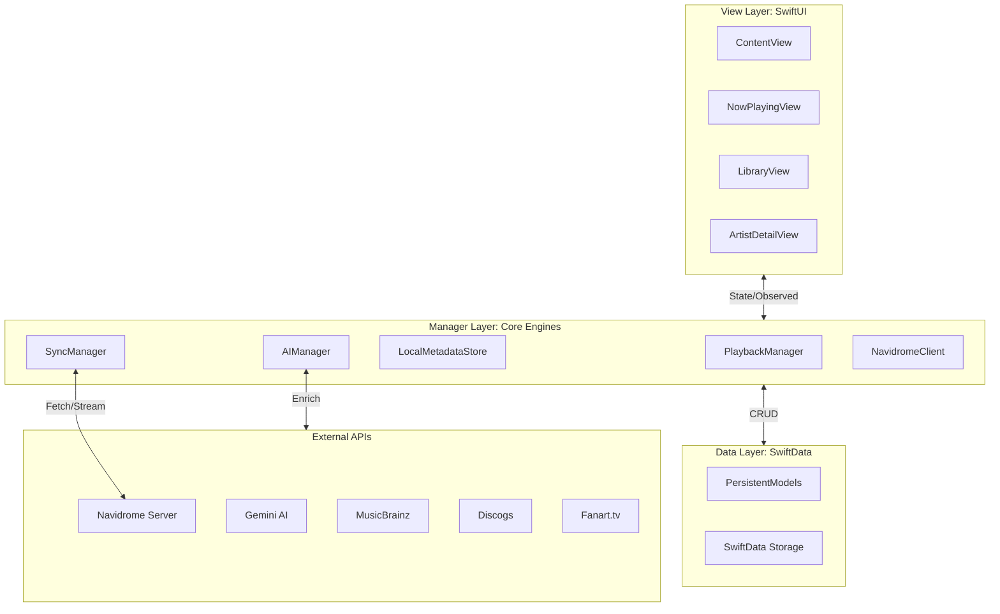

# Velora Project Architecture

Velora is a next-generation music experience designed with an **offline-first, AI-enriched, and cinematic** architectural philosophy. It leverages a modern layered approach to ensure high performance, visual fluidity, and intelligent metadata orchestration.

---

## 1. Architectural Overview

Velora follows a strict separation of concerns through three primary layers, orchestrated by a central dependency injection system at the application root.

### High-Level Topology

---

## 2. Core Layers

### A. View Layer (UI & Experience)
Built entirely using **SwiftUI**, the View Layer adheres to the "Cinematic Glassmorphism" design system.
- **Ambient Logic**: Views like `NowPlayingView` incorporate idle-timers (typically 8s) to transition into an "Ambient Mode," maximizing visual focus on artist backdrops.
- **Adaptive Layout**: Components utilize CSS-inspired container query logic (adapted for SwiftUI) to ensure native iPad resolution and fluid scaling across orientations.
- **State Injection**: Managers are accessed via `@EnvironmentObject`, ensuring a single source of truth for playback and sync status across all tabs.

### B. Manager Layer (The "Engines")
The "brain" of Velora, consisting of long-lived actors and managers that handle asynchronous operations.
- **PlaybackManager**: A dual-engine system. It uses `AVPlayer` for standard streaming and a custom `AVSampleBufferAudioRenderer` for bit-perfect Hi-Fi playback. It features a "Look-ahead" buffer (Last 3%) for gapless transitions.
- **AIManager**: The metadata orchestrator. It manages the multi-stage enrichment pipeline (Gemini -> MusicBrainz -> Discogs -> Fanart.tv).
- **SyncManager**: Manages differential synchronization, ensuring the local cache reflects the remote server state without redundant downloads.
- **LocalMetadataStore**: A high-performance interface for **SwiftData**, configured with manual saving (`autosaveEnabled = false`) to prevent UI hitching during large batch updates.

### C. Data Layer (Persistence)
Velora maintains a strict boundary between runtime models and persistent storage.
- **PersistentModels**: SwiftData schemas (`PersistentTrack`, `PersistentArtist`, `PersistentAlbum`) that include AI-specific fields such as `aiGenrePrediction`, `atmosphere`, and `primaryColor`.
- **Codable Models**: Lightweight structs used for API serialization and internal logic, ensuring the database remains decoupled from network schemas.

---

## 3. Key Technical Strategies

### I. Offline-First Architecture
Velora treats the remote server as a source of truth for sync, but the local `LocalMetadataStore` as the primary source for the UI. This ensures:
- **Zero-Latency Browsing**: Artist lists and track metadata load instantly from disk.
- **Resilient Playback**: Local file paths are prioritized; streaming is only used as a fallback if the file is not yet cached.

### II. AI Enrichment Pipeline
The metadata enrichment flow is designed to handle the variability of external services:
1. **Gemini AI**: Analyzes track/album titles to predict "Mood" and "Genre."
2. **MusicBrainz**: Resolves MBIDs and fetches artist biographies.
3. **Discogs**: Verifies release years and high-resolution cover art.
4. **Fanart.tv**: Fetches artist-specific immersive backdrops for the glassmorphic UI.

### III. Audio Fidelity
To cater to audiophiles, the engine implements:
- **Look-ahead Buffering**: Pre-loading the next track asset at 97% completion of the current track.
- **Integrity Verification**: Post-download checks to ensure media files are not corrupted before being added to the playback queue.

---

## 4. Resiliency & Performance

- **Rate-Limit Throttling**: The `AIManager` incorporates enforced sleep intervals (e.g., 5 seconds between Gemini calls) to respect API constraints.
- **Task Yielding**: Long-running library audits explicitly use `Task.yield()` to ensure the main thread remains responsive to user interaction.
- **Network Privacy**: Timeouts and retry logic are tuned to handle iPadOS 18 network permission prompts gracefully.

---

> [!NOTE]
> This architecture is a living document. As Velora evolves towards more complex AI features, the Manager Layer will continue to expand with specialized "Intelligence Modules."
